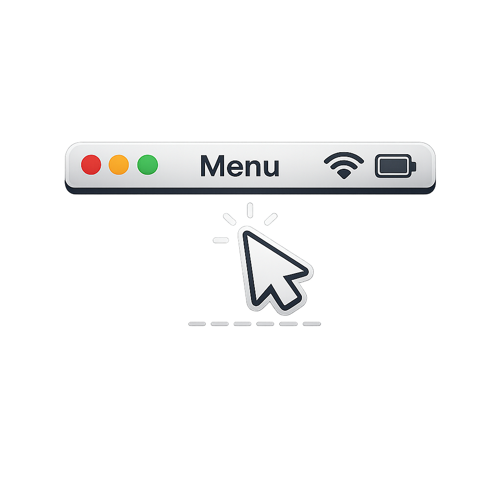

# ZenBar

ZenBar is a macOS SwiftUI utility to control menu bar behavior in fullscreen for installed apps.

It manages the `AppleMenuBarVisibleInFullscreen` key in each app's defaults domain so you can quickly choose:

- `Stock` (remove override)
- `Force Hide` (set to `false`)
- `Force Show` (set to `true`)

## Features

- Scans installed apps from:
  - `/Applications`
  - `/System/Applications`
  - `~/Applications`
- Fast searchable app list
- Per-app menu bar mode control:
  - `Stock`
  - `Force Hide`
  - `Force Show`
- Batch state discovery using `defaults find AppleMenuBarVisibleInFullscreen`

## How It Works

ZenBar runs the same `defaults` commands you would run in Terminal.

- Force Hide:
  - `defaults write <bundle-id> AppleMenuBarVisibleInFullscreen -bool false`
- Force Show:
  - `defaults write <bundle-id> AppleMenuBarVisibleInFullscreen -bool true`
- Stock:
  - `defaults delete <bundle-id> AppleMenuBarVisibleInFullscreen`

## Requirements

- macOS 15+
- Xcode 16+

## Run Locally

1. Clone this repo.
2. Open `ZenBar.xcodeproj` in Xcode.
3. Select the `ZenBar` scheme.
4. Build and run.

## Usage

1. Launch ZenBar and let it scan installed apps.
2. Search by app name or bundle identifier.
3. Choose a mode per app:
   - `Stock` - remove override
   - `Force Hide` - hide menu bar in fullscreen
   - `Force Show` - show menu bar in fullscreen
4. Re-enter fullscreen in the target app (or relaunch the target app if needed).

## Notes and Permissions

- App Sandbox is disabled for this utility so it can edit preferences for other app domains.
- Apps generally apply changes only after relaunch(Command + Q).

## License

This project is licensed under the MIT License. See `LICENSE`.
